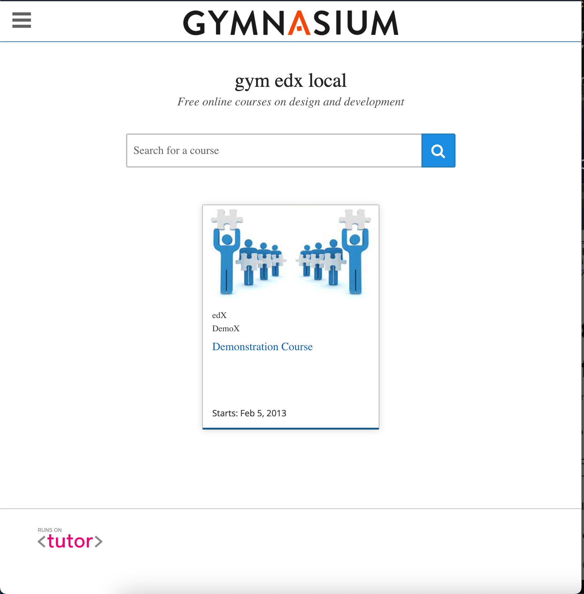

Gym Theme
=========

This theme is a heavily altered fork of the Indigo theme, intended for a specific use.

**Note**: This version of the theme is compatible with the Olive release of Open edX.

Installation
------------

The Gym theme is a modified version of Indigo, which in turn was specially developed to be used with `Tutor <https://docs.tutor.overhang.io>`__ (at least v14.0.0). If you have not installed Open edX with Tutor, then installation instructions will vary.

Since the Gym theme is not listed in the Tutor plugins index, you'll have to clone it manually yourself::

    cd "$(tutor plugins printroot)"
    git clone https://github.com/gymnasium/gym-theme-tutor-plugin
    pip install -e gym-theme-tutor-plugin
    tutor plugins enable gym
    tutor config save

Rebuild the Openedx docker image::

    tutor images build openedx

Restart your platform::

    tutor local start -d

You will then have to enable the "gym" theme, as per the `Tutor documentation <https://docs.tutor.overhang.io/local.html#setting-a-new-theme>`__::

    tutor local do settheme gym

Configuration
-------------

- ``GYM_WELCOME_MESSAGE`` (default: "The place for all your online learning")
- ``GYM_PRIMARY_COLOR`` (default: "#3b85ff")
- ``GYM_FOOTER_NAV_LINKS`` (default: ``[{"title": "About", "url": "/about"}, {"title": "Contact", "url": "/contact"}]``)
- ``GYM_FOOTER_LEGAL_LINKS`` (default: ``[{"title": "Terms of service", "url": "/tos"}, {"title": "Indigo theme for Open edX", "url": "https://github.com/gymnasium/gym-theme-tutor-plugin"}]``)

The ``GYM_*`` settings listed above may be modified by running ``tutor config save --set GYM_...=...``. For instance, to remove all links from the footer, run::

    tutor config save --set "GYM_FOOTER_NAV_LINKS=[]" --set "GYM_FOOTER_LEGAL_LINKS=[]"

Customization
-------------

This plugin can serve as a starting point to create your own themes. Just fork this repository and modify the files as you see fit.

Changing the default logo and other images
~~~~~~~~~~~~~~~~~~~~~~~~~~~~~~~~~~~~~~~~~~

The theme images are stored in `gymtheme/templates/gym/lms/static/images <https://github.com/gymnasium/gym-theme-tutor-plugin/tree/master/gymtheme/templates/gym/lms/static/images>`__ for the LMS, and in `gymtheme/templates/gym/cms/static/images <https://github.com/gymnasium/gym-theme-tutor-plugin/tree/master/gymtheme/templates/gym/cms/static/images>`__ for the CMS. To use custom images in your theme, just replace the files stored in these folders with your own.

Overriding the default "about", "contact", etc. static pages
~~~~~~~~~~~~~~~~~~~~~~~~~~~~~~~~~~~~~~~~~~~~~~~~~~~~~~~~~~~~

By default, the ``/about`` and ``/contact`` pages contain a simple line of text: "This page left intentionally blank. Feel free to add your own content". This is of course unusable in production. In the following, we detail how to override just any of the static templates used in Open edX.

The static templates used by Open edX to render those pages are all stored in the `edx-platform/lms/templates/static_templates <https://github.com/edx/edx-platform/tree/open-release/olive.master/lms/templates/static_templates>`__ folder. To override those templates, you should add your own in the following folder::

    ls gymtheme/templates/gym/lms/templates/static_templates"

For instance, edit the "donate.html" file in this directory. We can derive the content of this file from the contents of the `donate.html <https://github.com/edx/edx-platform/blob/open-release/olive.master/lms/templates/static_templates/donate.html>`__ static template in edx-platform::

    <%page expression_filter="h"/>
    <%! from django.utils.translation import ugettext as _ %>
    <%inherit file="../main.html" />

    <%block name="pagetitle">${_("Donate")}</%block>

    <main id="main" aria-label="Content" tabindex="-1">
        <section class="container about">
            <h1>
                <%block name="pageheader">${page_header or _("Donate")}</%block>
            </h1>
            

                <%block name="pagecontent">Add a compelling message here, asking for donations.</%block>
            

        </section>
    </main>

This new template will then be used to render the /donate url.

Tutor Notes
-----------

This Tutor plugin is maintained by Régis Behmo from `Overhang.IO <https://overhang.io>`__. Community support is available from the official `Open edX forum <https://discuss.openedx.org>`__. Do you need help with this plugin? See the `troubleshooting <https://docs.tutor.overhang.io/troubleshooting.html>`__ section from the Tutor documentation.

You can view the Indigo theme in action at https://demo.openedx.overhang.io.

License
-------

This work is licensed under the terms of the `GNU Affero General Public License (AGPL) <https://github.com/gymnasium/gym-theme-tutor-plugin/blob/master/LICENSE.txt>`_.
